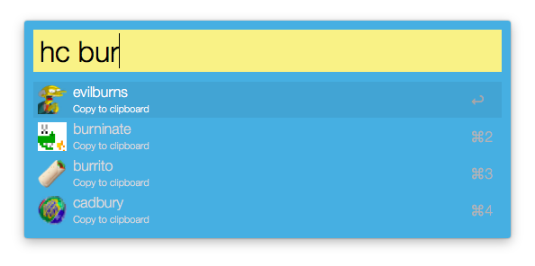

# HipChat Emoticons

Download [hipchat-emoticons.alfredworkflow](https://github.com/trepmal/HipChat-Emoticons/blob/master/hipchat-emoticons.alfredworkflow?raw=true)

# Setup

First, run `hipapi YOURAPIKEY` - this should be your HipChat API key (must have view_group scope).

Then run `hipupdate` again to begin fetching icons. Please note this could take a while and may need to be run a few times depending on how many emoticons you have.

You may run the command periodically to keep updating your workflow.

# Usage
Once you have your emoticons, `hc` will list all of them, and `hc {query}` will only show those that contain a match.

